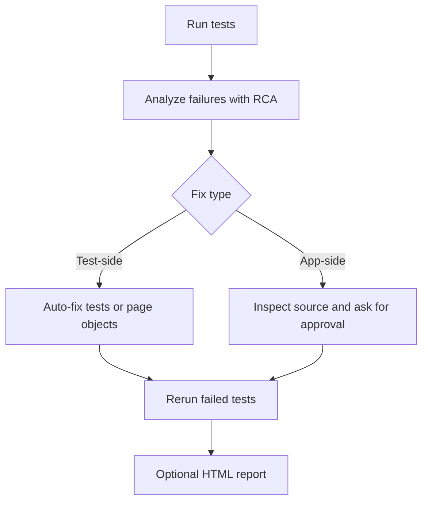

# Engineering Design (Quick EDD): TestPilot AI

## What this project is

`playwright-copilot-qa-agent` is a skill-based QA agent that helps you run Playwright tests, investigate failures, apply fixes, and validate the results.

## Why it exists

Debugging test failures manually is slow and repetitive.  
This agent creates a clear, repeatable process so investigations are faster and easier to track.

## How it works (simple flow)

Full source flowchart: `docs/working-flowchart.mmd`

## Skills in one line each

- `playwright-test-runner`: Runs full suite or failed-only reruns
- `playwright-rca`: Investigates failures and writes root-cause artifacts
- `playwright-fixer`: Applies fixes and records what changed
- `generate-rca-report`: Builds optional HTML summary

## Key rules

- RCA needs a source repo path/link from the user
- RCA is analysis-only (no code edits)
- Source code changes need explicit user approval
- Test runs should go through the test-runner skill

## Main outputs

Session artifacts are written under `ai-reports/<session-id>/`, including:

- `failure-report.md`
- `diagnosis.json`
- `root-cause-report.md`
- `fixer-report.md`

## Current limitations

- Requires reachable app `baseURL`
- Requires source repo path for RCA
- Flaky environments can still impact rerun confidence
